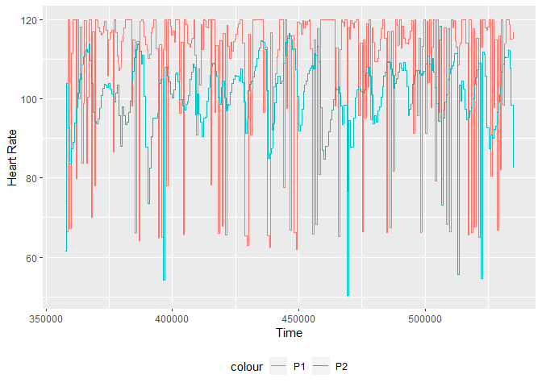

Assignment 4 - Heart rate, respiration and interpersonal coordination
=====================================================================

Physiological data (here heart rate \[variability\], and respiration)
are increasingly popular. Historically treated as pernicious noise to be
regressed out of neuro-imaging data, there is now increasing research on
how these signals tell us something important about cognition and beyond
being just a signal of cognitive processes also impact them in
interesting ways. Advanced sport science, and the quantified self
movement (closely followed by marketing and communication) have hailed
continuous physiological tracking as a powerful way to access and modify
attitudes, habits, and performance. Further, as team coordination (in
the military, in decision processes and organizational contexts) is more
and more in focus, research has attempted to measure how interpersonal
coordination between physiological systems might tell us something
important about e.g. emotional and cognitive coordination. See
references in the reading list for more on this.

In this assignment, you will learn to: - collect physiological data -
pre-process physiological data (and grow further your mad R skills) -
model the continuous interdependence between two signals (using a
multilevel model as proxy for a dynamical system approach) -
conservatively assess the presence of coordination between to signals in
a controlled context

This assignment has two parts. The first part familiarizes you with
heart rate, and respiration data and their preprocessing. The second
part explores how to analyze interpersonal coordination of these
signals.

Let’s get started
-----------------

``` r
# Load the libraries
library(pacman)
pacman::p_load(ggplot2)
p_load(gridExtra, groupdata2, tidyverse)
library(stringi)
library(lme4)
```

    ## Loading required package: Matrix

    ## 
    ## Attaching package: 'Matrix'

    ## The following objects are masked from 'package:tidyr':
    ## 
    ##     expand, pack, unpack

### Exploring physiological signals

-   Choose one pair (one pair, three conditions)
-   Load the logs
-   Produce a plot of the participants’ respiration signal and a
    different one of the participants’ HR signal. N.B: remember the
    slides: artifacts, downsampling, scaling. N.B. The
    gridExtra::grid.arrange() function allows you to display the plots
    side by side. E.g. grid.arrange(plot1, plot2, plot3, ncol=3). There
    are also smarter packages, like cowplot and ggpubr.
-   Can you eye-ball which condition if any displays more physiological
    coordination?

### First we read one data file and identify the procedure

-   Load the file
-   correctly identify all columns
-   plot the data
-   deal with the artifacts
-   downsample the dat
-   Add a column for study, group, trial and condition

``` r
# Load the file
sync <- read.csv("data/Study4_G3_T3_Synchronous.csv")
# We plot the data

#We plot respiration data for both participants
plot_resp <- ggplot(data = sync) +
  geom_path(aes(sync$TimeMs, Resp1, color = "P1")) +
  geom_path(aes(sync$TimeMs, Resp2, color = "P2")) +
  labs(x = "Time", y = "Resp") +
  theme(legend.position="bottom")
plot_resp
```


``` r
#We plot heart rate data for both participants
plot_hr <- ggplot(data = sync) +
  geom_path(aes(sync$TimeMs, HR1, color = "P1")) +
  geom_path(aes(sync$TimeMs, HR2, color = "P2")) +
  labs(x = "Time", y = "Heart Rate") +
  theme(legend.position="bottom")
plot_hr 
```



``` r
# We make the two plots on top of eachother
gridExtra::grid.arrange(plot_resp, plot_hr)
```


``` r
## Remove outliers


### Tip, check the function below
removeOuts <- function(ts,threshold){
  SD_plus=(mean(ts,na.rm=T) + sd(ts,na.rm=T)*2.5)
  SD_minus=(mean(ts,na.rm=T) - sd(ts,na.rm=T)*2.5)
  
  ts[ts > (mean(ts,na.rm=T) + (threshold*sd(ts,na.rm=T)))] = SD_plus
  ts[ts < (mean(ts,na.rm=T) - (threshold*sd(ts,na.rm=T)))] = SD_minus # This works so that values that where bigger/smaller than 2.5*SD away from the mean are now equal to SD*2.5 + mean
  return(ts)
}
threshold=2.5 # Default value at 2.5 sds from the mean
#We try with the respiration data 
sync$Resp1_r <- removeOuts(sync$Resp1, 2.5)
sync$Resp2_r <- removeOuts(sync$Resp2, 2.5)
#We do it with heart rate
sync$HR1_r <- removeOuts(sync$HR1, 2.5)
sync$HR2_r <- removeOuts(sync$HR2, 2.5)
#We plot to see how it worked
compare1 <- ggplot(data = sync) +
  geom_path(aes(sync$TimeMs, Resp1, color = "Original")) +
  geom_path(aes(sync$TimeMs, Resp1_r, color = "Removed")) +
  labs(x = "Time (ms)", y = "Respiration") +
  theme(legend.position="bottom") + ggtitle("Participant 1")

compare2 <- ggplot(data = sync) +
  geom_path(aes(sync$TimeMs, Resp2, color = "Original")) +
  geom_path(aes(sync$TimeMs, Resp2_r, color = "Removed")) +
  labs(x = "Time (ms)", y = "Respiration") +
  theme(legend.position="bottom")+ ggtitle("Participant 2")

compare3 <- ggplot(data = sync) +
  geom_path(aes(sync$TimeMs, HR1, color = "Original")) +
  geom_path(aes(sync$TimeMs, HR1_r, color = "Removed")) +
  labs(x = "Time (ms)", y = "Heart Rate") +
  theme(legend.position="bottom") + ggtitle("Participant 1")

compare4 <- ggplot(data = sync) +
  geom_path(aes(sync$TimeMs, HR2, color = "Original")) +
  geom_path(aes(sync$TimeMs, HR2_r, color = "Removed")) +
  labs(x = "Time (ms)", y = "Heart Rate") +
  theme(legend.position="bottom") + ggtitle("Participant 2")

# Plot raw data againt those with the artiacts removed
#We plot all visualizations together in a grid
gridExtra::grid.arrange(compare1, compare2, compare3, compare4)
```


``` r
## We scale the data (and overwrite to the original columns, så these are the ones we will use)
sync$Resp1 <- scale(sync$Resp1_r)
sync$Resp2 <- scale(sync$Resp2_r)
sync$HR1 <- scale(sync$HR1_r)
sync$HR2 <- scale(sync$HR2_r)

### Tip: if scale() gives some issues, try the one below
#z_scale <- function(column){
#  column_c <- (column - mean(column)) / sd(column)
#}

# Plot again to check how scaled data look like
#We plot to see how it worked
s1 <- ggplot(data = sync) +
  geom_path(aes(sync$TimeMs, Resp1, color = "Scaled")) +
  geom_path(aes(sync$TimeMs, Resp1_r, color = "Not-scaled")) +
  labs(x = "Time (ms)", y = "Respiration") +
  theme(legend.position="bottom") + ggtitle("Participant 1")

s2 <- ggplot(data = sync) +
  geom_path(aes(sync$TimeMs, Resp2, color = "Scaled")) +
  geom_path(aes(sync$TimeMs, Resp2_r, color = "Not scaled")) +
  labs(x = "Time (ms)", y = "Respiration") +
  theme(legend.position="bottom")+ ggtitle("Participant 2")

s3 <- ggplot(data = sync) +
  geom_path(aes(sync$TimeMs, HR1, color = "Scaled")) +
  geom_path(aes(sync$TimeMs, HR1_r, color = "Not scaled")) +
  labs(x = "Time (ms)", y = "Heart Rate") +
  theme(legend.position="bottom") + ggtitle("Participant 1")

s4 <- ggplot(data = sync) +
  geom_path(aes(sync$TimeMs, HR2, color = "Sacled")) +
  geom_path(aes(sync$TimeMs, HR2_r, color = "Not scaled")) +
  labs(x = "Time (ms)", y = "Heart Rate") +
  theme(legend.position="bottom") + ggtitle("Participant 2")

#We plot all visualizations together in a grid
gridExtra::grid.arrange(s1, s2, s3, s4)
```


``` r
## Downsample
### This is tricky, so you can have a look at my code  (relying on Ludvig's groupdata2) if you get stuck
#We make a column with each 
sync$rowname <- rep(1:177323)

p_load(tidyverse)
#We downsample
d1 = sync %>%
 group(n = 100, method = 'greedy') %>%
 dplyr::summarise(
   time = mean(TimeMs,na.rm=T),
   HR1 = mean(HR1,na.rm=T),
   HR2 = mean(HR2,na.rm=T),
   Resp1 = mean(Resp1,na.rm=T),
   Resp2 = mean(Resp2,na.rm=T),
   rowname = rowname[1]) #the index we use to put them back together

## Plot the downsampled data
d_resp <- ggplot(data = d1) +
  geom_path(aes(time, Resp1, color = "P1")) +
  geom_path(aes(time, Resp2, color = "P2")) +
  labs(x = "time (ms)", y = "Resp") +
  theme(legend.position="bottom") + ggtitle("Respiration data")

# We plot the heart rate data
d_HR <- ggplot(data = d1) +
  geom_path(aes(time, HR1, color = "P1")) +
  geom_path(aes(time, HR2, color = "P2")) +
  labs(x = "time (ms)", y = "Heart rate") +
  theme(legend.position="bottom") + ggtitle("Heart rate data")

#We plot them together
gridExtra::grid.arrange(d_HR, d_resp)
```


``` r
# We see that we get some flat lines. Probably from loose belts
```

Now add the group, trial, condition to the cleaned up, scaled, downsampled data
-------------------------------------------------------------------------------

Tip the info is in the file name
--------------------------------

``` r
# We need to make a function that can read the data, remove outliers, and downsampling

#### Function for preprocessing all data 
# read_filename <- function(filename){
#      
#     # load data
#      data <- read.delim(filename, sep = ",")
#      
#           #In one study (study 4) there is no time column, instead it's called TimeMs (except for one       where it's time but in minutes.) Therefore we added this to rename that column for study 4
#      study <- stringr::word(filename, start = 1, sep = "_") #Takes out the filename in a new          variable study
#      study <- stringr::str_sub(study, start = 6) #Takes the study
#      if (study=="4"){data <- data %>% rename(time = TimeMs)} #If study is study 4 it renames
#     
#      data$time <- as.numeric(data$time)
#      
#      if (study=="4"){data$time <- data$time/1000} # changing study 4 to seconds      
#      #we downsample
#      data$rowname<-rep(1:nrow(data),1)
#      
#      data = data %>%
#       group(n = 1000, method = 'greedy') %>%
#       dplyr::summarise(
#         time = mean(time,na.rm=T),
#         HR1 = mean(HR1,na.rm=T),
#         HR2 = mean(HR2,na.rm=T),
#         Resp1 = mean(Resp1,na.rm=T),
#         Resp2 = mean(Resp2,na.rm=T),
#         rowname = rowname[1])
#     
#      #we remove outliers
#      data$Resp1<-removeOuts(data$Resp1,2.5)
#      data$Resp2<-removeOuts(data$Resp2,2.5)
#      data$HR1<-removeOuts(data$HR1,2.5)
#      data$HR2<-removeOuts(data$HR2,2.5)
#      
#      #we scale
#      data$Resp1<-scale(data$Resp1)
#      data$Resp2<-scale(data$Resp2)
#      data$HR1<-scale(data$HR1)
#      data$HR2<-scale(data$HR2)
#      
#     # parse filename to extract study, diagnosis, subject and trial
#      data$group <- word(filename, start = -3, sep = "_")
#      data$group<-str_sub(data$group, start = 2)
#      
#      data$condition <- word(filename, start = -1, sep = "_")
#      data$condition<-str_sub(data$condition, end = -5)
#      
#      data$study <- word(filename, start = 1, sep = "_")
#      data$study<-str_sub(data$study, start = 6)
#      
#      data$trial <- word(filename, start = 3, sep = "_")
#      data$trial <-str_sub(data$trial, start = 2)
#      
#      data$.groups = NULL
#      data$rowname = NULL
#      
#      return(data)
# }
# 
# #Test on one file 
# test <- read_filename("Study1_G1_T1_Synchronous.csv")
# 
# 
# #  Identify all files to be read
# # Run the function on the whole dataset using map_df
# listed<- list.files(pattern="*.csv") %>% 
#     purrr::map_df(read_filename) 
# 
# #Creating unique ID for each pair acros studies 
# listed <- listed %>% mutate(uPairID = paste(study, group, sep = "_"), 
#                     uPairID = as.numeric(as.factor(uPairID)))
# 
# write.csv(listed, "data_study_4.csv")
```

Now we are ready to go to load and pre-process all files
--------------------------------------------------------

We will plot to look for flat lines etc. and exclude if there are any
---------------------------------------------------------------------

``` r
#We load out df created before
phys_data <- read.csv("pre/data_study_4.csv")

# We should look especially on study 4
#For group 7
#Filter out
study_4 <- phys_data %>% filter(condition == "Synchronous" & group == "7")
#Plot
study_4_plot <- ggplot(study_4) + geom_path(aes(time, Resp1, color = "Participant 1")) +
  geom_path(aes(time, Resp2, color = "Participant 2")) +
  labs(x = "time (s)", y = "Respiration") +
  theme(legend.position="bottom") + ggtitle("Study 4 Group 7 Synchronous")
study_4_plot
```


``` r
#For group 8
#Filter out
study_4 <- phys_data %>% filter(condition == "Synchronous" & group == "8")
#Plot
study_4_plot_2 <- ggplot(study_4) + geom_path(aes(time, Resp1, color = "Participant 1")) +
  geom_path(aes((time), Resp2, color = "Participant 2")) +
  labs(x = "time (s)", y = "Respiration") +
  theme(legend.position="bottom") + ggtitle("Study 4 Group 8 Synchronous")
study_4_plot_2
```


``` r
## For the other condition

#Filter out
study_4 <- phys_data %>% filter(condition == "Conversation" & group == "7")
#Plot
study_4_plot_3 <- ggplot(study_4) + geom_path(aes(time, Resp1, color = "Participant 1")) +
  geom_path(aes(time, Resp2, color = "Participant 2")) +
  labs(x = "time (s)", y = "Respiration") +
  theme(legend.position="bottom") + ggtitle("Study 4 Group 7 Conversation")

#For group 8
#Filter out
study_4 <- phys_data %>% filter(condition == "Conversation" & group == "8")
#Plot
study_4_plot_4 <- ggplot(study_4) + geom_path(aes(time, Resp1, color = "Participant 1")) +
  geom_path(aes(time, Resp2, color = "Participant 2")) +
  labs(x = "time (s)", y = "Respiration") +
  theme(legend.position="bottom") + ggtitle("Study 4 Group 8 Conversation")

## For the third condition

#Filter out
study_4 <- phys_data %>% filter(condition == "TurnTaking" & group == "7")
#Plot
study_4_plot_5 <- ggplot(study_4) + geom_path(aes(time, Resp1, color = "Participant 1")) +
  geom_path(aes(time, Resp2, color = "Participant 2")) +
  labs(x = "time (s)", y = "Respiration") +
  theme(legend.position="bottom") + ggtitle("Study 4 Group 7 Conversation")

#For group 8
#Filter out
study_4 <- phys_data %>% filter(condition == "TurnTaking" & group == "8")
#Plot
study_4_plot_6 <- ggplot(study_4) + geom_path(aes(time, Resp1, color = "Participant 1")) +
  geom_path(aes(time, Resp2, color = "Participant 2")) +
  labs(x = "time (s)", y = "Respiration") +
  theme(legend.position="bottom") + ggtitle("Study 4 Group 8 Conversation")

#We plot them together two and two
gridExtra::grid.arrange(study_4_plot, study_4_plot_2)
```


``` r
gridExtra::grid.arrange(study_4_plot_3, study_4_plot_4)
```


``` r
gridExtra::grid.arrange(study_4_plot_5, study_4_plot_6)
```


Now for Heart Rate data

``` r
# We choose to only look at speaking data
# We should look especially on study 4
#For group 7
#Filter out
study_4 <- phys_data %>% filter(condition == "Synchronous" & group == "7")
#Plot
study_4_plot <- ggplot(study_4) + geom_path(aes(time, HR1, color = "Participant 1")) +
  geom_path(aes(time, HR2, color = "Participant 2")) +
  labs(x = "time (s)", y = "Heart Rate") +
  theme(legend.position="bottom") + ggtitle("Study 4 Group 7 Synchronous")

#For group 8
#Filter out
study_4 <- phys_data %>% filter(condition == "Synchronous" & group == "8")
#Plot
study_4_plot_2 <- ggplot(study_4) + geom_path(aes(time, HR1, color = "Participant 1")) +
  geom_path(aes((time), HR2, color = "Participant 2")) +
  labs(x = "time (s)", y = "Heart Rate") +
  theme(legend.position="bottom") + ggtitle("Study 4 Group 8 Synchronous")

## For the other condition

#Filter out
study_4 <- phys_data %>% filter(condition == "Conversation" & group == "7")
#Plot
study_4_plot_3 <- ggplot(study_4) + geom_path(aes(time, HR1, color = "Participant 1")) +
  geom_path(aes(time, HR2, color = "Participant 2")) +
  labs(x = "time (s)", y = "Heart Rate") +
  theme(legend.position="bottom") + ggtitle("Study 4 Group 7 Conversation")

#For group 8
#Filter out
study_4 <- phys_data %>% filter(condition == "Conversation" & group == "8")
#Plot
study_4_plot_4 <- ggplot(study_4) + geom_path(aes(time, HR1, color = "Participant 1")) +
  geom_path(aes(time, HR2, color = "Participant 2")) +
  labs(x = "time (s)", y = "Heart Rate") +
  theme(legend.position="bottom") + ggtitle("Study 4 Group 8 Conversation")

## For the third condition

#Filter out
study_4 <- phys_data %>% filter(condition == "TurnTaking" & group == "7")
#Plot
study_4_plot_5 <- ggplot(study_4) + geom_path(aes(time, HR1, color = "Participant 1")) +
  geom_path(aes(time, HR2, color = "Participant 2")) +
  labs(x = "time (s)", y = "Heart Rate") +
  theme(legend.position="bottom") + ggtitle("Study 4 Group 7 Conversation")

#For group 8
#Filter out
study_4 <- phys_data %>% filter(condition == "TurnTaking" & group == "8")
#Plot
study_4_plot_6 <- ggplot(study_4) + geom_path(aes(time, HR1, color = "Participant 1")) +
  geom_path(aes(time, HR2, color = "Participant 2")) +
  labs(x = "time (s)", y = "Heart Rate") +
  theme(legend.position="bottom") + ggtitle("Study 4 Group 8 Conversation")

#We plot them together
gridExtra::grid.arrange(study_4_plot, study_4_plot_2)
```


``` r
gridExtra::grid.arrange(study_4_plot_3, study_4_plot_4)
```


``` r
gridExtra::grid.arrange(study_4_plot_5, study_4_plot_6)
```


We see that group 7 in the synchronous condition has a flat point for
heart rate for participant two in the middle.(We each did two groups
each in the studygroup and this was the only one with visisble flat
lines). We should exclude this condition for that pair.

``` r
# Remove bad data

#First we remove the movement data
phys_data <- phys_data %>% filter(condition == "TurnTaking" | condition == "Synchronous" | condition == "Conversation")

# We remove group 7 condition synchronous
try <- subset(phys_data, group!=7)
try_2 <- subset(phys_data, group==7 & condition!="Synchronous")
phys_data <- merge(try, try_2, all = T)

# Save the data
```

Now we need to run some analysis
--------------------------------

Let’s start with a multilevel model that accounts for - stability (how
each signal is autocorrelated) - interpersonal dependence (each signal
is dependent from the previous state of the other signal)

The data needs to be further prepared, so we can analyze both
participants in the same model. We need to turn the data into a long
format: - a column indicating own hr and one own respiration - a column
indicating other hr and one other respiration - a column indicating
change in hr from previous round and one in respiration

We can then run an analysis where change is a function of one’s previous
state (stability, see slides), and the other’s previous state
(coupling). Make sure to: - set up the most interesting contrasts: how
do these parameters vary by condition? which condition should be
baseline? - set up the right random effects. - N.B. the model will be
slow. Make sure it works on a subset of the data first!

Preprocessing before analysis

``` r
# Genearate a column for each: previous HR1, HR2, Resp1, Resp2
## We use group by first

phys_data <- phys_data %>% group_by(condition, study, group) %>% mutate(
  HR1_past = lag(HR1, 1),
  HR2_past = lag(HR2, 1),
  Resp1_past = lag(Resp1, 1),
  Resp2_past = lag(Resp2, 1),
)
  
# Genearate a column for each: change in HR1, HR2, Resp1, Resp2
phys_data$HR1_change <- phys_data$HR1-phys_data$HR1_past
phys_data$HR2_change <- phys_data$HR2-phys_data$HR2_past
phys_data$Resp1_change <- phys_data$Resp1-phys_data$Resp1_past
phys_data$Resp2_change <- phys_data$Resp2-phys_data$Resp2_past

## Remember to predict from HR_past

# Make the data long, so we can analyze both participants at the same time 
## N.B. This is a bit tricky and you might have to do it in several steps

d_hr_change <- gather(phys_data, participant, HR_change_self, HR1_change, HR2_change)%>%
  select(time, HR_change_self, participant, study, group, condition) %>% 
  mutate(participant = parse_number(as.character(group)) * 10 + parse_number(participant)) 

#We need to make an HR_change_other column
d_hr_change_other <- gather(phys_data, participant, HR_change_other, HR2_change, HR1_change)%>%
  select(time, HR_change_other, participant, study, group, condition) %>% 
  mutate(participant = parse_number(as.character(group)) * 10 + parse_number(participant)) 

##### We make HR_self and HR_other as we need them later #####

HR_self<- gather(phys_data, participant, HR_self, HR1, HR2)%>%
  select(time, HR_self, participant, study, group, condition) %>% 
  mutate(participant = parse_number(as.character(group)) * 10 + parse_number(participant))

HR_other <- gather(phys_data, participant, HR_other, HR2, HR1)%>%
  select(time, HR_other, participant, study, group, condition) %>% 
  mutate(participant = parse_number(as.character(group)) * 10 + parse_number(participant))

#We will make one for HR_self past 
d_hr_self <- gather(phys_data, participant, HR_self_past, HR1_past, HR2_past)%>%
  select(time, HR_self_past, participant, study, group, condition) %>% 
  mutate(participant = parse_number(as.character(group)) * 10 + parse_number(participant)) 

#We will make one for HR_other past
d_hr_other <- gather(phys_data, participant, HR_other_past, HR2_past, HR1_past)%>%
  select(time, HR_other_past, participant, study, group, condition) %>% 
  mutate(participant = parse_number(as.character(group)) * 10 + parse_number(participant)) 

#We need to add the two column to our other dfs
d_hr_change$HR_change_other <- d_hr_change_other$HR_change_other
d_hr_self$HR_other_past <- d_hr_other$HR_other_past
d_hr_self$HR_other <- HR_other$HR_other
d_hr_self$HR_self <- HR_self$HR_self

#Now we have the dataframe for d_resp_change

d_resp_change <- gather(phys_data, participant, Resp_change_self, Resp1_change, Resp2_change) %>% select(time, Resp_change_self, participant, study, group, condition) %>% mutate(participant = parse_number(as.character(group)) * 10 + parse_number(participant))

### For respiration
#adding for other
#We need to make an HR_change_other column
d_resp_change_other <- gather(phys_data, participant, Resp_change_other, Resp2_change, Resp1_change)%>%
  select(time, Resp_change_other, participant, study, group, condition, Resp1_past, Resp2_past) %>% 
  mutate(participant = parse_number(as.character(group)) * 10 + parse_number(participant)) 
d_resp_change$Resp_change_other <- d_resp_change_other$Resp_change_other

# Now we need to merge
dd <- merge(d_hr_change, d_resp_change)
dd <- merge(dd, d_hr_self)

write.csv(dd, "dd.csv")
```

Analysis

``` r
library(lmerTest)
```

    ## 
    ## Attaching package: 'lmerTest'

    ## The following object is masked from 'package:lme4':
    ## 
    ##     lmer

    ## The following object is masked from 'package:stats':
    ## 
    ##     step

``` r
# We use : to better interpret the interaction
model_c <- lmer(HR_change_self ~ 0 + condition + 
                (HR_self_past + HR_other_past):condition + 
                (0 + condition | participant) +
                (0 + condition | group), data = dd)
```

    ## boundary (singular) fit: see ?isSingular

``` r
#Also run it with the star * so we can see whether the interaction is there

model_s <- lmer(HR_change_self ~ 0 + condition + 
                (HR_self_past + HR_other_past)*condition + 
                (0 + condition | participant) +
                (0 + condition | group), data = dd)
```

    ## boundary (singular) fit: see ?isSingular

    ## Warning: Model failed to converge with 1 negative eigenvalue: -1.2e+02

``` r
summary(model_s)
```

    ## Linear mixed model fit by REML. t-tests use Satterthwaite's method [
    ## lmerModLmerTest]
    ## Formula: 
    ## HR_change_self ~ 0 + condition + (HR_self_past + HR_other_past) *  
    ##     condition + (0 + condition | participant) + (0 + condition |  
    ##     group)
    ##    Data: dd
    ## 
    ## REML criterion at convergence: 18430.4
    ## 
    ## Scaled residuals: 
    ##     Min      1Q  Median      3Q     Max 
    ## -6.4986 -0.4853  0.0755  0.5500  5.8691 
    ## 
    ## Random effects:
    ##  Groups      Name                  Variance  Std.Dev.  Corr       
    ##  participant conditionConversation 2.492e-10 1.579e-05            
    ##              conditionSynchronous  9.463e-12 3.076e-06 -1.00      
    ##              conditionTurnTaking   1.947e-10 1.395e-05  1.00 -1.00
    ##  group       conditionConversation 0.000e+00 0.000e+00            
    ##              conditionSynchronous  1.399e-11 3.741e-06   NaN      
    ##              conditionTurnTaking   2.072e-10 1.440e-05   NaN -0.54
    ##  Residual                          5.935e-01 7.704e-01            
    ## Number of obs: 7936, groups:  participant, 16; group, 8
    ## 
    ## Fixed effects:
    ##                                      Estimate Std. Error         df
    ## conditionConversation               4.496e-03  1.435e-02  7.927e+03
    ## conditionSynchronous                5.955e-03  1.593e-02  7.927e+03
    ## conditionTurnTaking                 1.662e-03  1.478e-02  7.924e+03
    ## HR_self_past                       -3.632e-01  1.444e-02  7.927e+03
    ## HR_other_past                       1.578e-02  1.444e-02  7.927e+03
    ## conditionSynchronous:HR_self_past  -4.549e-02  2.156e-02  7.927e+03
    ## conditionTurnTaking:HR_self_past    1.407e-02  2.071e-02  7.927e+03
    ## conditionSynchronous:HR_other_past -9.474e-03  2.156e-02  7.927e+03
    ## conditionTurnTaking:HR_other_past  -3.502e-02  2.071e-02  7.927e+03
    ##                                    t value Pr(>|t|)    
    ## conditionConversation                0.313   0.7541    
    ## conditionSynchronous                 0.374   0.7085    
    ## conditionTurnTaking                  0.112   0.9105    
    ## HR_self_past                       -25.155   <2e-16 ***
    ## HR_other_past                        1.093   0.2743    
    ## conditionSynchronous:HR_self_past   -2.111   0.0348 *  
    ## conditionTurnTaking:HR_self_past     0.680   0.4967    
    ## conditionSynchronous:HR_other_past  -0.440   0.6603    
    ## conditionTurnTaking:HR_other_past   -1.691   0.0908 .  
    ## ---
    ## Signif. codes:  0 '***' 0.001 '**' 0.01 '*' 0.05 '.' 0.1 ' ' 1
    ## 
    ## Correlation of Fixed Effects:
    ##                     cndtnC cndtnS cndtTT HR_sl_ HR_th_ cndtnSynchrns:HR_s_
    ## cndtnSynchr          0.000                                                
    ## cndtnTrnTkn          0.000  0.000                                         
    ## HR_self_pst          0.002  0.000  0.000                                  
    ## HR_othr_pst          0.002  0.000  0.000 -0.076                           
    ## cndtnSynchrns:HR_s_ -0.001  0.002  0.000 -0.670  0.051                    
    ## cndtnTrnTkng:HR_s_  -0.001  0.000 -0.003 -0.697  0.053  0.467             
    ## cndtnSynchrns:HR_t_ -0.001  0.002  0.000  0.051 -0.670 -0.065             
    ## cndtnTrnTkng:HR_t_  -0.001  0.000 -0.003  0.053 -0.697 -0.035             
    ##                     cndtnTrnTkng:HR_s_ cndtnSynchrns:HR_t_
    ## cndtnSynchr                                               
    ## cndtnTrnTkn                                               
    ## HR_self_pst                                               
    ## HR_othr_pst                                               
    ## cndtnSynchrns:HR_s_                                       
    ## cndtnTrnTkng:HR_s_                                        
    ## cndtnSynchrns:HR_t_ -0.035                                
    ## cndtnTrnTkng:HR_t_  -0.040              0.467             
    ## convergence code: 0
    ## boundary (singular) fit: see ?isSingular

``` r
#Here we get significant conditionSynchronous:HR_self_past, conditionSynchronous:HR_other_past  and conditionTurnTaking:HR_other_past

# We want to look at coupling for conditionSynchronous:HR_other_past  and conditionTurnTaking:HR_other_past

# We make the model with 1 +
model_s_1 <- lmer(HR_change_self ~ 1 + condition + 
                (HR_self_past + HR_other_past)*condition + 
                (1 + condition | participant) +
                (1 + condition | group), data = dd)
```

    ## boundary (singular) fit: see ?isSingular

``` r
summary(model_s_1)
```

    ## Linear mixed model fit by REML. t-tests use Satterthwaite's method [
    ## lmerModLmerTest]
    ## Formula: 
    ## HR_change_self ~ 1 + condition + (HR_self_past + HR_other_past) *  
    ##     condition + (1 + condition | participant) + (1 + condition |  
    ##     group)
    ##    Data: dd
    ## 
    ## REML criterion at convergence: 18430.4
    ## 
    ## Scaled residuals: 
    ##     Min      1Q  Median      3Q     Max 
    ## -6.4986 -0.4853  0.0755  0.5500  5.8691 
    ## 
    ## Random effects:
    ##  Groups      Name                 Variance  Std.Dev.  Corr     
    ##  participant (Intercept)          0.000e+00 0.000e+00          
    ##              conditionSynchronous 3.622e-11 6.019e-06  NaN     
    ##              conditionTurnTaking  2.325e-10 1.525e-05  NaN 0.65
    ##  group       (Intercept)          0.000e+00 0.000e+00          
    ##              conditionSynchronous 8.005e-12 2.829e-06  NaN     
    ##              conditionTurnTaking  4.722e-10 2.173e-05  NaN 0.43
    ##  Residual                         5.935e-01 7.704e-01          
    ## Number of obs: 7936, groups:  participant, 16; group, 8
    ## 
    ## Fixed effects:
    ##                                      Estimate Std. Error         df
    ## (Intercept)                         4.496e-03  1.435e-02  7.927e+03
    ## conditionSynchronous                1.459e-03  2.144e-02  7.927e+03
    ## conditionTurnTaking                -2.834e-03  2.060e-02  7.925e+03
    ## HR_self_past                       -3.632e-01  1.444e-02  7.927e+03
    ## HR_other_past                       1.578e-02  1.444e-02  7.927e+03
    ## conditionSynchronous:HR_self_past  -4.549e-02  2.156e-02  7.927e+03
    ## conditionTurnTaking:HR_self_past    1.407e-02  2.071e-02  7.927e+03
    ## conditionSynchronous:HR_other_past -9.474e-03  2.156e-02  7.927e+03
    ## conditionTurnTaking:HR_other_past  -3.502e-02  2.071e-02  7.927e+03
    ##                                    t value Pr(>|t|)    
    ## (Intercept)                          0.313   0.7541    
    ## conditionSynchronous                 0.068   0.9458    
    ## conditionTurnTaking                 -0.138   0.8906    
    ## HR_self_past                       -25.155   <2e-16 ***
    ## HR_other_past                        1.093   0.2743    
    ## conditionSynchronous:HR_self_past   -2.111   0.0348 *  
    ## conditionTurnTaking:HR_self_past     0.680   0.4967    
    ## conditionSynchronous:HR_other_past  -0.440   0.6603    
    ## conditionTurnTaking:HR_other_past   -1.691   0.0908 .  
    ## ---
    ## Signif. codes:  0 '***' 0.001 '**' 0.01 '*' 0.05 '.' 0.1 ' ' 1
    ## 
    ## Correlation of Fixed Effects:
    ##                     (Intr) cndtnS cndtTT HR_sl_ HR_th_ cndtnSynchrns:HR_s_
    ## cndtnSynchr         -0.670                                                
    ## cndtnTrnTkn         -0.697  0.466                                         
    ## HR_self_pst          0.002 -0.001 -0.001                                  
    ## HR_othr_pst          0.002 -0.001 -0.001 -0.076                           
    ## cndtnSynchrns:HR_s_ -0.001  0.002  0.001 -0.670  0.051                    
    ## cndtnTrnTkng:HR_s_  -0.001  0.001 -0.001 -0.697  0.053  0.467             
    ## cndtnSynchrns:HR_t_ -0.001  0.002  0.001  0.051 -0.670 -0.065             
    ## cndtnTrnTkng:HR_t_  -0.001  0.001 -0.001  0.053 -0.697 -0.035             
    ##                     cndtnTrnTkng:HR_s_ cndtnSynchrns:HR_t_
    ## cndtnSynchr                                               
    ## cndtnTrnTkn                                               
    ## HR_self_pst                                               
    ## HR_othr_pst                                               
    ## cndtnSynchrns:HR_s_                                       
    ## cndtnTrnTkng:HR_s_                                        
    ## cndtnSynchrns:HR_t_ -0.035                                
    ## cndtnTrnTkng:HR_t_  -0.040              0.467             
    ## convergence code: 0
    ## boundary (singular) fit: see ?isSingular

``` r
############ We make a nice output for interpretation ########3
sum <- summary(model_s)
output <- as.data.frame(sum$coefficients)
sig_output <- subset(output, output$`Pr(>|t|)` < 0.05)
sig_output <- round(sig_output, 2)
#Making a column for nice read
sig_output$p_value <- ">0.01"
sig_output[2, 6] <- ">0.05"

#I get no p values
summary(model_c)
```

    ## Linear mixed model fit by REML. t-tests use Satterthwaite's method [
    ## lmerModLmerTest]
    ## Formula: 
    ## HR_change_self ~ 0 + condition + (HR_self_past + HR_other_past):condition +  
    ##     (0 + condition | participant) + (0 + condition | group)
    ##    Data: dd
    ## 
    ## REML criterion at convergence: 18430.4
    ## 
    ## Scaled residuals: 
    ##     Min      1Q  Median      3Q     Max 
    ## -6.4986 -0.4853  0.0755  0.5500  5.8691 
    ## 
    ## Random effects:
    ##  Groups      Name                  Variance  Std.Dev.  Corr       
    ##  participant conditionConversation 0.000e+00 0.000e+00            
    ##              conditionSynchronous  1.606e-09 4.008e-05   NaN      
    ##              conditionTurnTaking   1.142e-10 1.069e-05   NaN -0.99
    ##  group       conditionConversation 0.000e+00 0.000e+00            
    ##              conditionSynchronous  2.742e-11 5.236e-06   NaN      
    ##              conditionTurnTaking   1.758e-09 4.193e-05   NaN -0.05
    ##  Residual                          5.935e-01 7.704e-01            
    ## Number of obs: 7936, groups:  participant, 16; group, 8
    ## 
    ## Fixed effects:
    ##                                       Estimate Std. Error         df
    ## conditionConversation                4.496e-03  1.435e-02  7.927e+03
    ## conditionSynchronous                 5.955e-03  1.593e-02  7.922e+03
    ## conditionTurnTaking                  1.662e-03  1.478e-02  7.907e+03
    ## conditionConversation:HR_self_past  -3.632e-01  1.444e-02  7.927e+03
    ## conditionSynchronous:HR_self_past   -4.086e-01  1.601e-02  7.927e+03
    ## conditionTurnTaking:HR_self_past    -3.491e-01  1.484e-02  7.927e+03
    ## conditionConversation:HR_other_past  1.578e-02  1.444e-02  7.927e+03
    ## conditionSynchronous:HR_other_past   6.309e-03  1.601e-02  7.927e+03
    ## conditionTurnTaking:HR_other_past   -1.923e-02  1.484e-02  7.927e+03
    ##                                     t value Pr(>|t|)    
    ## conditionConversation                 0.313    0.754    
    ## conditionSynchronous                  0.374    0.708    
    ## conditionTurnTaking                   0.112    0.910    
    ## conditionConversation:HR_self_past  -25.155   <2e-16 ***
    ## conditionSynchronous:HR_self_past   -25.531   <2e-16 ***
    ## conditionTurnTaking:HR_self_past    -23.520   <2e-16 ***
    ## conditionConversation:HR_other_past   1.093    0.274    
    ## conditionSynchronous:HR_other_past    0.394    0.693    
    ## conditionTurnTaking:HR_other_past    -1.296    0.195    
    ## ---
    ## Signif. codes:  0 '***' 0.001 '**' 0.01 '*' 0.05 '.' 0.1 ' ' 1
    ## 
    ## Correlation of Fixed Effects:
    ##                     cndtnC cndtnS cndtTT cndtnCnvrstn:HR_s_
    ## cndtnSynchr          0.000                                 
    ## cndtnTrnTkn          0.000  0.000                          
    ## cndtnCnvrstn:HR_s_   0.002  0.000  0.000                   
    ## cndtnSynchrns:HR_s_  0.000  0.002  0.000  0.000            
    ## cndtnTrnTkng:HR_s_   0.000  0.000 -0.004  0.000            
    ## cndtnCnvrstn:HR_t_   0.002  0.000  0.000 -0.076            
    ## cndtnSynchrns:HR_t_  0.000  0.002  0.000  0.000            
    ## cndtnTrnTkng:HR_t_   0.000  0.000 -0.004  0.000            
    ##                     cndtnSynchrns:HR_s_ cndtnTrnTkng:HR_s_
    ## cndtnSynchr                                               
    ## cndtnTrnTkn                                               
    ## cndtnCnvrstn:HR_s_                                        
    ## cndtnSynchrns:HR_s_                                       
    ## cndtnTrnTkng:HR_s_   0.000                                
    ## cndtnCnvrstn:HR_t_   0.000               0.000            
    ## cndtnSynchrns:HR_t_ -0.056               0.000            
    ## cndtnTrnTkng:HR_t_   0.000              -0.007            
    ##                     cndtnCnvrstn:HR_t_ cndtnSynchrns:HR_t_
    ## cndtnSynchr                                               
    ## cndtnTrnTkn                                               
    ## cndtnCnvrstn:HR_s_                                        
    ## cndtnSynchrns:HR_s_                                       
    ## cndtnTrnTkng:HR_s_                                        
    ## cndtnCnvrstn:HR_t_                                        
    ## cndtnSynchrns:HR_t_  0.000                                
    ## cndtnTrnTkng:HR_t_   0.000              0.000             
    ## convergence code: 0
    ## boundary (singular) fit: see ?isSingular

``` r
summary(model_s)
```

    ## Linear mixed model fit by REML. t-tests use Satterthwaite's method [
    ## lmerModLmerTest]
    ## Formula: 
    ## HR_change_self ~ 0 + condition + (HR_self_past + HR_other_past) *  
    ##     condition + (0 + condition | participant) + (0 + condition |  
    ##     group)
    ##    Data: dd
    ## 
    ## REML criterion at convergence: 18430.4
    ## 
    ## Scaled residuals: 
    ##     Min      1Q  Median      3Q     Max 
    ## -6.4986 -0.4853  0.0755  0.5500  5.8691 
    ## 
    ## Random effects:
    ##  Groups      Name                  Variance  Std.Dev.  Corr       
    ##  participant conditionConversation 2.492e-10 1.579e-05            
    ##              conditionSynchronous  9.463e-12 3.076e-06 -1.00      
    ##              conditionTurnTaking   1.947e-10 1.395e-05  1.00 -1.00
    ##  group       conditionConversation 0.000e+00 0.000e+00            
    ##              conditionSynchronous  1.399e-11 3.741e-06   NaN      
    ##              conditionTurnTaking   2.072e-10 1.440e-05   NaN -0.54
    ##  Residual                          5.935e-01 7.704e-01            
    ## Number of obs: 7936, groups:  participant, 16; group, 8
    ## 
    ## Fixed effects:
    ##                                      Estimate Std. Error         df
    ## conditionConversation               4.496e-03  1.435e-02  7.927e+03
    ## conditionSynchronous                5.955e-03  1.593e-02  7.927e+03
    ## conditionTurnTaking                 1.662e-03  1.478e-02  7.924e+03
    ## HR_self_past                       -3.632e-01  1.444e-02  7.927e+03
    ## HR_other_past                       1.578e-02  1.444e-02  7.927e+03
    ## conditionSynchronous:HR_self_past  -4.549e-02  2.156e-02  7.927e+03
    ## conditionTurnTaking:HR_self_past    1.407e-02  2.071e-02  7.927e+03
    ## conditionSynchronous:HR_other_past -9.474e-03  2.156e-02  7.927e+03
    ## conditionTurnTaking:HR_other_past  -3.502e-02  2.071e-02  7.927e+03
    ##                                    t value Pr(>|t|)    
    ## conditionConversation                0.313   0.7541    
    ## conditionSynchronous                 0.374   0.7085    
    ## conditionTurnTaking                  0.112   0.9105    
    ## HR_self_past                       -25.155   <2e-16 ***
    ## HR_other_past                        1.093   0.2743    
    ## conditionSynchronous:HR_self_past   -2.111   0.0348 *  
    ## conditionTurnTaking:HR_self_past     0.680   0.4967    
    ## conditionSynchronous:HR_other_past  -0.440   0.6603    
    ## conditionTurnTaking:HR_other_past   -1.691   0.0908 .  
    ## ---
    ## Signif. codes:  0 '***' 0.001 '**' 0.01 '*' 0.05 '.' 0.1 ' ' 1
    ## 
    ## Correlation of Fixed Effects:
    ##                     cndtnC cndtnS cndtTT HR_sl_ HR_th_ cndtnSynchrns:HR_s_
    ## cndtnSynchr          0.000                                                
    ## cndtnTrnTkn          0.000  0.000                                         
    ## HR_self_pst          0.002  0.000  0.000                                  
    ## HR_othr_pst          0.002  0.000  0.000 -0.076                           
    ## cndtnSynchrns:HR_s_ -0.001  0.002  0.000 -0.670  0.051                    
    ## cndtnTrnTkng:HR_s_  -0.001  0.000 -0.003 -0.697  0.053  0.467             
    ## cndtnSynchrns:HR_t_ -0.001  0.002  0.000  0.051 -0.670 -0.065             
    ## cndtnTrnTkng:HR_t_  -0.001  0.000 -0.003  0.053 -0.697 -0.035             
    ##                     cndtnTrnTkng:HR_s_ cndtnSynchrns:HR_t_
    ## cndtnSynchr                                               
    ## cndtnTrnTkn                                               
    ## HR_self_pst                                               
    ## HR_othr_pst                                               
    ## cndtnSynchrns:HR_s_                                       
    ## cndtnTrnTkng:HR_s_                                        
    ## cndtnSynchrns:HR_t_ -0.035                                
    ## cndtnTrnTkng:HR_t_  -0.040              0.467             
    ## convergence code: 0
    ## boundary (singular) fit: see ?isSingular

``` r
summary(model_s_1)
```

    ## Linear mixed model fit by REML. t-tests use Satterthwaite's method [
    ## lmerModLmerTest]
    ## Formula: 
    ## HR_change_self ~ 1 + condition + (HR_self_past + HR_other_past) *  
    ##     condition + (1 + condition | participant) + (1 + condition |  
    ##     group)
    ##    Data: dd
    ## 
    ## REML criterion at convergence: 18430.4
    ## 
    ## Scaled residuals: 
    ##     Min      1Q  Median      3Q     Max 
    ## -6.4986 -0.4853  0.0755  0.5500  5.8691 
    ## 
    ## Random effects:
    ##  Groups      Name                 Variance  Std.Dev.  Corr     
    ##  participant (Intercept)          0.000e+00 0.000e+00          
    ##              conditionSynchronous 3.622e-11 6.019e-06  NaN     
    ##              conditionTurnTaking  2.325e-10 1.525e-05  NaN 0.65
    ##  group       (Intercept)          0.000e+00 0.000e+00          
    ##              conditionSynchronous 8.005e-12 2.829e-06  NaN     
    ##              conditionTurnTaking  4.722e-10 2.173e-05  NaN 0.43
    ##  Residual                         5.935e-01 7.704e-01          
    ## Number of obs: 7936, groups:  participant, 16; group, 8
    ## 
    ## Fixed effects:
    ##                                      Estimate Std. Error         df
    ## (Intercept)                         4.496e-03  1.435e-02  7.927e+03
    ## conditionSynchronous                1.459e-03  2.144e-02  7.927e+03
    ## conditionTurnTaking                -2.834e-03  2.060e-02  7.925e+03
    ## HR_self_past                       -3.632e-01  1.444e-02  7.927e+03
    ## HR_other_past                       1.578e-02  1.444e-02  7.927e+03
    ## conditionSynchronous:HR_self_past  -4.549e-02  2.156e-02  7.927e+03
    ## conditionTurnTaking:HR_self_past    1.407e-02  2.071e-02  7.927e+03
    ## conditionSynchronous:HR_other_past -9.474e-03  2.156e-02  7.927e+03
    ## conditionTurnTaking:HR_other_past  -3.502e-02  2.071e-02  7.927e+03
    ##                                    t value Pr(>|t|)    
    ## (Intercept)                          0.313   0.7541    
    ## conditionSynchronous                 0.068   0.9458    
    ## conditionTurnTaking                 -0.138   0.8906    
    ## HR_self_past                       -25.155   <2e-16 ***
    ## HR_other_past                        1.093   0.2743    
    ## conditionSynchronous:HR_self_past   -2.111   0.0348 *  
    ## conditionTurnTaking:HR_self_past     0.680   0.4967    
    ## conditionSynchronous:HR_other_past  -0.440   0.6603    
    ## conditionTurnTaking:HR_other_past   -1.691   0.0908 .  
    ## ---
    ## Signif. codes:  0 '***' 0.001 '**' 0.01 '*' 0.05 '.' 0.1 ' ' 1
    ## 
    ## Correlation of Fixed Effects:
    ##                     (Intr) cndtnS cndtTT HR_sl_ HR_th_ cndtnSynchrns:HR_s_
    ## cndtnSynchr         -0.670                                                
    ## cndtnTrnTkn         -0.697  0.466                                         
    ## HR_self_pst          0.002 -0.001 -0.001                                  
    ## HR_othr_pst          0.002 -0.001 -0.001 -0.076                           
    ## cndtnSynchrns:HR_s_ -0.001  0.002  0.001 -0.670  0.051                    
    ## cndtnTrnTkng:HR_s_  -0.001  0.001 -0.001 -0.697  0.053  0.467             
    ## cndtnSynchrns:HR_t_ -0.001  0.002  0.001  0.051 -0.670 -0.065             
    ## cndtnTrnTkng:HR_t_  -0.001  0.001 -0.001  0.053 -0.697 -0.035             
    ##                     cndtnTrnTkng:HR_s_ cndtnSynchrns:HR_t_
    ## cndtnSynchr                                               
    ## cndtnTrnTkn                                               
    ## HR_self_pst                                               
    ## HR_othr_pst                                               
    ## cndtnSynchrns:HR_s_                                       
    ## cndtnTrnTkng:HR_s_                                        
    ## cndtnSynchrns:HR_t_ -0.035                                
    ## cndtnTrnTkng:HR_t_  -0.040              0.467             
    ## convergence code: 0
    ## boundary (singular) fit: see ?isSingular

Now we need to create control baselines.
----------------------------------------

First shuffled controls, then surrogate pairs.

### Creating controls: shuffled controls

Shuffled controls break the temporal dependencies of time-series by
shuffling the value within one time-series. This ensures the
“coordination” observed is not due to the actual values in the series
and not their sequence. Tip: sample() is your friend, but make sure to
shuffle things within participant/condition and not throughout the whole
dataset

``` r
# Create a shuffled dataset

# Concatenate it to the original dataset (and remember to have a column telling you which is which)
shuffle <- dd
shuffle$HR_self = sample(dd$HR_self)
shuffle$HR_other = sample(dd$HR_other)
shuffle$HR_self_past = lag(dd$HR_self, 1)
shuffle$HR_change_self = dd$HR_self_past-dd$HR_self
shuffle$pair <- "shuffle"
dd$pair <- "real"
dd <- merge(dd, shuffle, all = T)

# Create the same models as in the previous chunk, but adding an interaction by shuffled vs. real

### We make it into long format

# We use : to better interpret the interaction. We add parenthesis to see the effect compared to our previous. 
model_shuffle <- lmer(HR_change_self ~ 0 + condition + 
                ((HR_self_past + HR_other_past):condition):pair + 
                (0 + condition | participant) +
                (0 + condition | group), data = dd)
```

    ## boundary (singular) fit: see ?isSingular

``` r
#Show output
summary(model_shuffle)
```

    ## Linear mixed model fit by REML. t-tests use Satterthwaite's method [
    ## lmerModLmerTest]
    ## Formula: 
    ## HR_change_self ~ 0 + condition + ((HR_self_past + HR_other_past):condition):pair +  
    ##     (0 + condition | participant) + (0 + condition | group)
    ##    Data: dd
    ## 
    ## REML criterion at convergence: 38579.7
    ## 
    ## Scaled residuals: 
    ##     Min      1Q  Median      3Q     Max 
    ## -7.0383 -0.4511  0.0094  0.4873  7.1568 
    ## 
    ## Random effects:
    ##  Groups      Name                  Variance  Std.Dev.  Corr       
    ##  participant conditionConversation 0.000e+00 0.000e+00            
    ##              conditionSynchronous  4.083e-12 2.021e-06   NaN      
    ##              conditionTurnTaking   1.349e-12 1.162e-06   NaN -0.90
    ##  group       conditionConversation 0.000e+00 0.000e+00            
    ##              conditionSynchronous  9.002e-14 3.000e-07  NaN       
    ##              conditionTurnTaking   3.833e-13 6.191e-07  NaN  0.77 
    ##  Residual                          6.621e-01 8.137e-01            
    ## Number of obs: 15871, groups:  participant, 16; group, 8
    ## 
    ## Fixed effects:
    ##                                                   Estimate Std. Error
    ## conditionConversation                           -2.841e-04  1.072e-02
    ## conditionSynchronous                            -4.998e-04  1.190e-02
    ## conditionTurnTaking                              7.351e-04  1.104e-02
    ## conditionConversation:HR_self_past:pairreal     -3.632e-01  1.525e-02
    ## conditionSynchronous:HR_self_past:pairreal      -4.087e-01  1.691e-02
    ## conditionTurnTaking:HR_self_past:pairreal       -3.491e-01  1.568e-02
    ## conditionConversation:HR_self_past:pairshuffle  -2.358e-03  1.606e-02
    ## conditionSynchronous:HR_self_past:pairshuffle   -1.343e-02  1.772e-02
    ## conditionTurnTaking:HR_self_past:pairshuffle    -1.347e-02  1.653e-02
    ## conditionConversation:HR_other_past:pairreal     1.578e-02  1.525e-02
    ## conditionSynchronous:HR_other_past:pairreal      6.293e-03  1.691e-02
    ## conditionTurnTaking:HR_other_past:pairreal      -1.923e-02  1.568e-02
    ## conditionConversation:HR_other_past:pairshuffle  1.244e-02  1.612e-02
    ## conditionSynchronous:HR_other_past:pairshuffle   2.028e-02  1.766e-02
    ## conditionTurnTaking:HR_other_past:pairshuffle    2.578e-02  1.644e-02
    ##                                                         df t value
    ## conditionConversation                            1.586e+04  -0.026
    ## conditionSynchronous                             1.586e+04  -0.042
    ## conditionTurnTaking                              1.586e+04   0.067
    ## conditionConversation:HR_self_past:pairreal      1.586e+04 -23.815
    ## conditionSynchronous:HR_self_past:pairreal       1.586e+04 -24.172
    ## conditionTurnTaking:HR_self_past:pairreal        1.586e+04 -22.267
    ## conditionConversation:HR_self_past:pairshuffle   1.586e+04  -0.147
    ## conditionSynchronous:HR_self_past:pairshuffle    1.586e+04  -0.758
    ## conditionTurnTaking:HR_self_past:pairshuffle     1.586e+04  -0.815
    ## conditionConversation:HR_other_past:pairreal     1.586e+04   1.035
    ## conditionSynchronous:HR_other_past:pairreal      1.586e+04   0.372
    ## conditionTurnTaking:HR_other_past:pairreal       1.586e+04  -1.227
    ## conditionConversation:HR_other_past:pairshuffle  1.586e+04   0.771
    ## conditionSynchronous:HR_other_past:pairshuffle   1.586e+04   1.149
    ## conditionTurnTaking:HR_other_past:pairshuffle    1.586e+04   1.568
    ##                                                 Pr(>|t|)    
    ## conditionConversation                              0.979    
    ## conditionSynchronous                               0.966    
    ## conditionTurnTaking                                0.947    
    ## conditionConversation:HR_self_past:pairreal       <2e-16 ***
    ## conditionSynchronous:HR_self_past:pairreal        <2e-16 ***
    ## conditionTurnTaking:HR_self_past:pairreal         <2e-16 ***
    ## conditionConversation:HR_self_past:pairshuffle     0.883    
    ## conditionSynchronous:HR_self_past:pairshuffle      0.449    
    ## conditionTurnTaking:HR_self_past:pairshuffle       0.415    
    ## conditionConversation:HR_other_past:pairreal       0.301    
    ## conditionSynchronous:HR_other_past:pairreal        0.710    
    ## conditionTurnTaking:HR_other_past:pairreal         0.220    
    ## conditionConversation:HR_other_past:pairshuffle    0.441    
    ## conditionSynchronous:HR_other_past:pairshuffle     0.251    
    ## conditionTurnTaking:HR_other_past:pairshuffle      0.117    
    ## ---
    ## Signif. codes:  0 '***' 0.001 '**' 0.01 '*' 0.05 '.' 0.1 ' ' 1

    ## 
    ## Correlation matrix not shown by default, as p = 15 > 12.
    ## Use print(x, correlation=TRUE)  or
    ##     vcov(x)        if you need it

    ## convergence code: 0
    ## boundary (singular) fit: see ?isSingular

``` r
######## We make a table woth significant coefficients ###########
sum <- summary(model_shuffle)
output <- as.data.frame(sum$coefficients)
sig_output <- subset(output, output$`Pr(>|t|)` < 0.05)
sig_output <- round(sig_output, 2)

#Also run it with the star * so we can see whether the interaction is there


model_shuffle_s <- lmer(HR_change_self ~ 0 + condition + 
                ((HR_self_past + HR_other_past)*condition)*pair + 
                (0 + condition | participant) +
                (0 + condition | group), data = dd)
```

    ## boundary (singular) fit: see ?isSingular

``` r
#Show output
summary(model_shuffle_s)
```

    ## Linear mixed model fit by REML. t-tests use Satterthwaite's method [
    ## lmerModLmerTest]
    ## Formula: 
    ## HR_change_self ~ 0 + condition + ((HR_self_past + HR_other_past) *  
    ##     condition) * pair + (0 + condition | participant) + (0 +  
    ##     condition | group)
    ##    Data: dd
    ## 
    ## REML criterion at convergence: 38596.4
    ## 
    ## Scaled residuals: 
    ##     Min      1Q  Median      3Q     Max 
    ## -7.0299 -0.4508  0.0107  0.4854  7.1622 
    ## 
    ## Random effects:
    ##  Groups      Name                  Variance  Std.Dev.  Corr       
    ##  participant conditionConversation 0.000e+00 0.000e+00            
    ##              conditionSynchronous  4.085e-12 2.021e-06   NaN      
    ##              conditionTurnTaking   1.357e-12 1.165e-06   NaN -0.89
    ##  group       conditionConversation 0.000e+00 0.000e+00            
    ##              conditionSynchronous  8.916e-14 2.986e-07  NaN       
    ##              conditionTurnTaking   3.830e-13 6.189e-07  NaN  0.77 
    ##  Residual                          6.622e-01 8.138e-01            
    ## Number of obs: 15871, groups:  participant, 16; group, 8
    ## 
    ## Fixed effects:
    ##                                                  Estimate Std. Error
    ## conditionConversation                           4.496e-03  1.516e-02
    ## conditionSynchronous                            5.955e-03  1.682e-02
    ## conditionTurnTaking                             1.662e-03  1.562e-02
    ## HR_self_past                                   -3.632e-01  1.525e-02
    ## HR_other_past                                   1.578e-02  1.525e-02
    ## pairshuffle                                    -9.560e-03  2.144e-02
    ## conditionSynchronous:HR_self_past              -4.549e-02  2.277e-02
    ## conditionTurnTaking:HR_self_past                1.407e-02  2.187e-02
    ## conditionSynchronous:HR_other_past             -9.474e-03  2.277e-02
    ## conditionTurnTaking:HR_other_past              -3.502e-02  2.187e-02
    ## HR_self_past:pairshuffle                        3.608e-01  2.215e-02
    ## HR_other_past:pairshuffle                      -3.340e-03  2.219e-02
    ## conditionSynchronous:pairshuffle               -3.353e-03  3.203e-02
    ## conditionTurnTaking:pairshuffle                 7.707e-03  3.078e-02
    ## conditionSynchronous:HR_self_past:pairshuffle   3.455e-02  3.302e-02
    ## conditionTurnTaking:HR_self_past:pairshuffle   -2.514e-02  3.177e-02
    ## conditionSynchronous:HR_other_past:pairshuffle  1.727e-02  3.302e-02
    ## conditionTurnTaking:HR_other_past:pairshuffle   4.836e-02  3.176e-02
    ##                                                        df t value Pr(>|t|)
    ## conditionConversation                           1.585e+04   0.296   0.7669
    ## conditionSynchronous                            1.585e+04   0.354   0.7234
    ## conditionTurnTaking                             1.585e+04   0.106   0.9152
    ## HR_self_past                                    1.585e+04 -23.813   <2e-16
    ## HR_other_past                                   1.585e+04   1.035   0.3007
    ## pairshuffle                                     1.585e+04  -0.446   0.6557
    ## conditionSynchronous:HR_self_past               1.585e+04  -1.998   0.0457
    ## conditionTurnTaking:HR_self_past                1.585e+04   0.643   0.5199
    ## conditionSynchronous:HR_other_past              1.585e+04  -0.416   0.6773
    ## conditionTurnTaking:HR_other_past               1.585e+04  -1.601   0.1094
    ## HR_self_past:pairshuffle                        1.585e+04  16.289   <2e-16
    ## HR_other_past:pairshuffle                       1.585e+04  -0.150   0.8804
    ## conditionSynchronous:pairshuffle                1.585e+04  -0.105   0.9166
    ## conditionTurnTaking:pairshuffle                 1.585e+04   0.250   0.8023
    ## conditionSynchronous:HR_self_past:pairshuffle   1.585e+04   1.046   0.2955
    ## conditionTurnTaking:HR_self_past:pairshuffle    1.585e+04  -0.791   0.4288
    ## conditionSynchronous:HR_other_past:pairshuffle  1.585e+04   0.523   0.6010
    ## conditionTurnTaking:HR_other_past:pairshuffle   1.585e+04   1.523   0.1279
    ##                                                   
    ## conditionConversation                             
    ## conditionSynchronous                              
    ## conditionTurnTaking                               
    ## HR_self_past                                   ***
    ## HR_other_past                                     
    ## pairshuffle                                       
    ## conditionSynchronous:HR_self_past              *  
    ## conditionTurnTaking:HR_self_past                  
    ## conditionSynchronous:HR_other_past                
    ## conditionTurnTaking:HR_other_past                 
    ## HR_self_past:pairshuffle                       ***
    ## HR_other_past:pairshuffle                         
    ## conditionSynchronous:pairshuffle                  
    ## conditionTurnTaking:pairshuffle                   
    ## conditionSynchronous:HR_self_past:pairshuffle     
    ## conditionTurnTaking:HR_self_past:pairshuffle      
    ## conditionSynchronous:HR_other_past:pairshuffle    
    ## conditionTurnTaking:HR_other_past:pairshuffle     
    ## ---
    ## Signif. codes:  0 '***' 0.001 '**' 0.01 '*' 0.05 '.' 0.1 ' ' 1

    ## 
    ## Correlation matrix not shown by default, as p = 18 > 12.
    ## Use print(x, correlation=TRUE)  or
    ##     vcov(x)        if you need it

    ## convergence code: 0
    ## boundary (singular) fit: see ?isSingular

``` r
######## We make a table woth significant coefficients ###########
sum <- summary(model_shuffle_s)
output <- as.data.frame(sum$coefficients)
sig_output <- subset(output, output$`Pr(>|t|)` < 0.05)
sig_output <- round(sig_output, 2)
#Making a column for nice read
sig_output$p_value <- ">0.01"
sig_output[2, 6] <- ">0.05"

#We relevel to get shuffle pair as baseline
dd$pair <- as.factor(dd$pair)
dd$pair <- ordered(dd$pair, levels = c("shuffle", "real"))
levels(dd$pair)
```

    ## [1] "shuffle" "real"

``` r
#Model with 1 and releveled
model_shuffle_s_1 <- lmer(HR_change_self ~ 1 + condition + 
                ((HR_self_past + HR_other_past)*condition)*pair + 
                (1 + condition | participant) +
                (1 + condition | group), data = dd)
```

    ## boundary (singular) fit: see ?isSingular

``` r
#We get the output
summary(model_shuffle_s_1)
```

    ## Linear mixed model fit by REML. t-tests use Satterthwaite's method [
    ## lmerModLmerTest]
    ## Formula: 
    ## HR_change_self ~ 1 + condition + ((HR_self_past + HR_other_past) *  
    ##     condition) * pair + (1 + condition | participant) + (1 +  
    ##     condition | group)
    ##    Data: dd
    ## 
    ## REML criterion at convergence: 38602.7
    ## 
    ## Scaled residuals: 
    ##     Min      1Q  Median      3Q     Max 
    ## -7.0299 -0.4508  0.0107  0.4854  7.1622 
    ## 
    ## Random effects:
    ##  Groups      Name                 Variance  Std.Dev.  Corr       
    ##  participant (Intercept)          0.000e+00 0.000e+00            
    ##              conditionSynchronous 1.308e-14 1.144e-07   NaN      
    ##              conditionTurnTaking  2.072e-10 1.439e-05   NaN -0.17
    ##  group       (Intercept)          0.000e+00 0.000e+00            
    ##              conditionSynchronous 2.323e-10 1.524e-05   NaN      
    ##              conditionTurnTaking  3.575e-10 1.891e-05   NaN -1.00
    ##  Residual                         6.622e-01 8.138e-01            
    ## Number of obs: 15871, groups:  participant, 16; group, 8
    ## 
    ## Fixed effects:
    ##                                             Estimate Std. Error         df
    ## (Intercept)                               -2.842e-04  1.072e-02  1.585e+04
    ## conditionSynchronous                      -2.175e-04  1.602e-02  1.584e+04
    ## conditionTurnTaking                        1.019e-03  1.539e-02  1.583e+04
    ## HR_self_past                              -1.828e-01  1.107e-02  1.585e+04
    ## HR_other_past                              1.411e-02  1.110e-02  1.585e+04
    ## pair.L                                     6.760e-03  1.516e-02  1.585e+04
    ## conditionSynchronous:HR_self_past         -2.822e-02  1.651e-02  1.585e+04
    ## conditionTurnTaking:HR_self_past           1.503e-03  1.589e-02  1.585e+04
    ## conditionSynchronous:HR_other_past        -8.407e-04  1.651e-02  1.585e+04
    ## conditionTurnTaking:HR_other_past         -1.084e-02  1.588e-02  1.585e+04
    ## HR_self_past:pair.L                       -2.551e-01  1.566e-02  1.585e+04
    ## HR_other_past:pair.L                       2.362e-03  1.569e-02  1.585e+04
    ## conditionSynchronous:pair.L                2.371e-03  2.265e-02  1.585e+04
    ## conditionTurnTaking:pair.L                -5.449e-03  2.177e-02  1.585e+04
    ## conditionSynchronous:HR_self_past:pair.L  -2.443e-02  2.335e-02  1.585e+04
    ## conditionTurnTaking:HR_self_past:pair.L    1.778e-02  2.247e-02  1.585e+04
    ## conditionSynchronous:HR_other_past:pair.L -1.221e-02  2.335e-02  1.585e+04
    ## conditionTurnTaking:HR_other_past:pair.L  -3.420e-02  2.246e-02  1.585e+04
    ##                                           t value Pr(>|t|)    
    ## (Intercept)                                -0.027   0.9789    
    ## conditionSynchronous                       -0.014   0.9892    
    ## conditionTurnTaking                         0.066   0.9472    
    ## HR_self_past                              -16.506   <2e-16 ***
    ## HR_other_past                               1.272   0.2035    
    ## pair.L                                      0.446   0.6557    
    ## conditionSynchronous:HR_self_past          -1.709   0.0875 .  
    ## conditionTurnTaking:HR_self_past            0.095   0.9246    
    ## conditionSynchronous:HR_other_past         -0.051   0.9594    
    ## conditionTurnTaking:HR_other_past          -0.682   0.4950    
    ## HR_self_past:pair.L                       -16.289   <2e-16 ***
    ## HR_other_past:pair.L                        0.150   0.8804    
    ## conditionSynchronous:pair.L                 0.105   0.9166    
    ## conditionTurnTaking:pair.L                 -0.250   0.8023    
    ## conditionSynchronous:HR_self_past:pair.L   -1.046   0.2955    
    ## conditionTurnTaking:HR_self_past:pair.L     0.791   0.4288    
    ## conditionSynchronous:HR_other_past:pair.L  -0.523   0.6010    
    ## conditionTurnTaking:HR_other_past:pair.L   -1.523   0.1279    
    ## ---
    ## Signif. codes:  0 '***' 0.001 '**' 0.01 '*' 0.05 '.' 0.1 ' ' 1

    ## 
    ## Correlation matrix not shown by default, as p = 18 > 12.
    ## Use print(x, correlation=TRUE)  or
    ##     vcov(x)        if you need it

    ## convergence code: 0
    ## boundary (singular) fit: see ?isSingular

``` r
######## We make a table woth significant coefficients ###########
sum <- summary(model_shuffle_s_1)
output <- as.data.frame(sum$coefficients)
sig_output <- subset(output, output$`Pr(>|t|)` < 0.05)
sig_output <- round(sig_output, 2)
#Making a column for nice read
sig_output$p_value <- ">0.01"
sig_output[2, 6] <- ">0.05"
```

### Creating controls: surrogate pair controls

-   Per each real pair, identify at least one surrogate pair (matching
    one of the participants, with somebody doing the same task, but in a
    different pair)

``` r
# Identify unique pairs within a given study (to keep things manageable) and create list of possible surrogate pairs (e.g. individual 1 from pair 1 and individual 2 from pair 2)

# Starting from the wide format, create "surrogate" dataset with the data from surrogate pairs
Groups <- as.numeric(as.character(unique(phys_data$group[phys_data$study==4]))) # List all pairs

SurrogateList <- expand.grid(a = Groups, b = Groups) # Identify all possible combinations of 2 pairs
SurrogateList = subset(SurrogateList, a != b)  # exclude combinations with identical pairs
#We only want 8 surrogate pairs
set.seed(33)
rows <- sample(nrow(SurrogateList), 8)
SurrogateList <- SurrogateList[rows, ]

surrodf <- tibble()
for (i in 1:nrow(SurrogateList)){ # loop through all combinations
  x <- subset(phys_data,group==SurrogateList$a[i]) # subset data from the first pair
  y <- subset(phys_data,group==SurrogateList$b[i]) # subset data from the second pair
  group <- c(800+((1:4)*i)) # create new pair id
  
  for (co in c("Synchronous","TurnTaking", "Conversation")){ # loop through conditions
    if(co %in% unique(y$condition)){ # check that both pairs have the data for that condition
      
      z1 <- subset(x,condition==co) # subset only that condition from first pair
      z2 <- subset(y,condition==co) # subset only that condition from second pair
      
      if (nrow(z1)>nrow(z2)){ # make sure data have same length in both pairs
      z1 <- z1[1:nrow(z2),]
      }
      if (nrow(z2)>nrow(z1)){
      z2 <- z2[1:nrow(z1),]
      }
      w1 <- z1 %>% mutate( # assemble new pair combining the 2 pairs
        HR2=z2$HR2,
        HR2_past=z2$HR2_past,
        HR2_change = z2$HR2_change)
    }
    surrodf <- bind_rows(surrodf, w1)
    }
  }
surrodf$type <- "surrogate"
phys_data$type <- "real"
# Make it into long format
surro <- bind_rows(surrodf, phys_data)


###### We create HR_change_self like we have done earlier ############
d_hr_change <- gather(surro, participant, HR_change_self, HR1_change, HR2_change)%>%
  select(time, HR_change_self, participant, study, group, condition, type) %>% 
  mutate(participant = parse_number(as.character(group)) * 10 + parse_number(participant)) 

#We need to make an HR_change_other column
d_hr_change_other <- gather(surro, participant, HR_change_other, HR2_change, HR1_change)%>%
  select(time, HR_change_other, participant, study, group, condition, type) %>% 
  mutate(participant = parse_number(as.character(group)) * 10 + parse_number(participant)) 

##### We make HR_self and HR_other like before #####

HR_self<- gather(surro, participant, HR_self, HR1, HR2)%>%
  select(time, HR_self, participant, study, group, condition, type) %>% 
  mutate(participant = parse_number(as.character(group)) * 10 + parse_number(participant))

HR_other <- gather(surro, participant, HR_other, HR2, HR1)%>%
  select(time, HR_other, participant, study, group, condition, type) %>% 
  mutate(participant = parse_number(as.character(group)) * 10 + parse_number(participant))

######### We make HR_self past like earlier ############

#We will make one for HR_self past 
d_hr_self <- gather(surro, participant, HR_self_past, HR1_past, HR2_past)%>%
  select(time, HR_self_past, participant, study, group, condition, type) %>% 
  mutate(participant = parse_number(as.character(group)) * 10 + parse_number(participant)) 

#We will make one for HR_other past
d_hr_other <- gather(surro, participant, HR_other_past, HR2_past, HR1_past)%>%
  select(time, HR_other_past, participant, study, group, condition, type) %>% 
  mutate(participant = parse_number(as.character(group)) * 10 + parse_number(participant)) 

#We need to add the two column to our other dfs
d_hr_change$HR_change_other <- d_hr_change_other$HR_change_other
d_hr_self$HR_other_past <- d_hr_other$HR_other_past
d_hr_self$HR_other <- HR_other$HR_other
d_hr_self$HR_self <- HR_self$HR_self

# We merge them together like earlier
dd_surro <- merge(d_hr_change, d_hr_self)

# Create models as in chunks above, but adding an interaction with the Real vs. Surrogate variable (exclude shuffled ones for simplicity)
#We add type as an interaction
# We use : to better interpret the interaction. We add parenthesis to see the effect compared to our previous. 

model_su <- lmer(HR_change_self ~ 0 + condition + 
                ((HR_self_past + HR_other_past):condition):type + 
                (0 + condition | participant) +
                (0 + condition | group), data = dd_surro)
```

    ## boundary (singular) fit: see ?isSingular

``` r
#MOdel output
summary(model_su)
```

    ## Linear mixed model fit by REML. t-tests use Satterthwaite's method [
    ## lmerModLmerTest]
    ## Formula: 
    ## HR_change_self ~ 0 + condition + ((HR_self_past + HR_other_past):condition):type +  
    ##     (0 + condition | participant) + (0 + condition | group)
    ##    Data: dd_surro
    ## 
    ## REML criterion at convergence: 51020.2
    ## 
    ## Scaled residuals: 
    ##     Min      1Q  Median      3Q     Max 
    ## -7.1183 -0.4633  0.0732  0.5036  5.9482 
    ## 
    ## Random effects:
    ##  Groups      Name                  Variance  Std.Dev.  Corr       
    ##  participant conditionConversation 0.000e+00 0.000e+00            
    ##              conditionSynchronous  1.736e-11 4.167e-06   NaN      
    ##              conditionTurnTaking   1.243e-11 3.525e-06   NaN -0.03
    ##  group       conditionConversation 6.176e-11 7.859e-06            
    ##              conditionSynchronous  6.491e-12 2.548e-06 -1.00      
    ##              conditionTurnTaking   1.032e-11 3.212e-06 -0.74  0.74
    ##  Residual                          5.782e-01 7.604e-01            
    ## Number of obs: 22240, groups:  participant, 16; group, 8
    ## 
    ## Fixed effects:
    ##                                                     Estimate Std. Error
    ## conditionConversation                              7.603e-03  8.181e-03
    ## conditionSynchronous                               4.350e-03  9.368e-03
    ## conditionTurnTaking                                7.508e-03  9.082e-03
    ## conditionConversation:HR_self_past:typereal       -3.631e-01  1.425e-02
    ## conditionSynchronous:HR_self_past:typereal        -4.087e-01  1.580e-02
    ## conditionTurnTaking:HR_self_past:typereal         -3.491e-01  1.465e-02
    ## conditionConversation:HR_self_past:typesurrogate  -3.188e-01  1.006e-02
    ## conditionSynchronous:HR_self_past:typesurrogate   -1.667e-01  1.159e-02
    ## conditionTurnTaking:HR_self_past:typesurrogate    -3.122e-01  1.184e-02
    ## conditionConversation:HR_other_past:typereal       1.579e-02  1.425e-02
    ## conditionSynchronous:HR_other_past:typereal        6.305e-03  1.580e-02
    ## conditionTurnTaking:HR_other_past:typereal        -1.926e-02  1.465e-02
    ## conditionConversation:HR_other_past:typesurrogate -2.841e-02  1.006e-02
    ## conditionSynchronous:HR_other_past:typesurrogate  -1.016e-02  1.159e-02
    ## conditionTurnTaking:HR_other_past:typesurrogate   -2.963e-02  1.184e-02
    ##                                                           df t value
    ## conditionConversation                              2.215e+04   0.929
    ## conditionSynchronous                               2.221e+04   0.464
    ## conditionTurnTaking                                2.221e+04   0.827
    ## conditionConversation:HR_self_past:typereal        2.222e+04 -25.485
    ## conditionSynchronous:HR_self_past:typereal         2.222e+04 -25.867
    ## conditionTurnTaking:HR_self_past:typereal          2.222e+04 -23.831
    ## conditionConversation:HR_self_past:typesurrogate   2.222e+04 -31.693
    ## conditionSynchronous:HR_self_past:typesurrogate    2.222e+04 -14.387
    ## conditionTurnTaking:HR_self_past:typesurrogate     2.222e+04 -26.353
    ## conditionConversation:HR_other_past:typereal       2.222e+04   1.108
    ## conditionSynchronous:HR_other_past:typereal        2.222e+04   0.399
    ## conditionTurnTaking:HR_other_past:typereal         2.222e+04  -1.315
    ## conditionConversation:HR_other_past:typesurrogate  2.222e+04  -2.825
    ## conditionSynchronous:HR_other_past:typesurrogate   2.222e+04  -0.877
    ## conditionTurnTaking:HR_other_past:typesurrogate    2.222e+04  -2.501
    ##                                                   Pr(>|t|)    
    ## conditionConversation                              0.35267    
    ## conditionSynchronous                               0.64242    
    ## conditionTurnTaking                                0.40844    
    ## conditionConversation:HR_self_past:typereal        < 2e-16 ***
    ## conditionSynchronous:HR_self_past:typereal         < 2e-16 ***
    ## conditionTurnTaking:HR_self_past:typereal          < 2e-16 ***
    ## conditionConversation:HR_self_past:typesurrogate   < 2e-16 ***
    ## conditionSynchronous:HR_self_past:typesurrogate    < 2e-16 ***
    ## conditionTurnTaking:HR_self_past:typesurrogate     < 2e-16 ***
    ## conditionConversation:HR_other_past:typereal       0.26790    
    ## conditionSynchronous:HR_other_past:typereal        0.68983    
    ## conditionTurnTaking:HR_other_past:typereal         0.18863    
    ## conditionConversation:HR_other_past:typesurrogate  0.00473 ** 
    ## conditionSynchronous:HR_other_past:typesurrogate   0.38059    
    ## conditionTurnTaking:HR_other_past:typesurrogate    0.01238 *  
    ## ---
    ## Signif. codes:  0 '***' 0.001 '**' 0.01 '*' 0.05 '.' 0.1 ' ' 1

    ## 
    ## Correlation matrix not shown by default, as p = 15 > 12.
    ## Use print(x, correlation=TRUE)  or
    ##     vcov(x)        if you need it

    ## convergence code: 0
    ## boundary (singular) fit: see ?isSingular

``` r
######## We make a table woth significant coefficients ###########
sum <- summary(model_su)
output <- as.data.frame(sum$coefficients)
output <- round(output, 2)
#We want to show only the significant
sig_output <- subset(output, output$`Pr(>|t|)` < 0.05)
sig_output$p_value <- ">0.01"
sig_output[7, 6] <- ">0.05"

#Also run it with the star * so we can see whether the interaction is there

model_su_s <- lmer(HR_change_self ~ 0 + condition + 
                ((HR_self_past + HR_other_past)*condition)*type + 
                (0 + condition | participant) +
                (0 + condition | group), data = dd_surro)
```

    ## boundary (singular) fit: see ?isSingular

``` r
#Output
summary(model_su_s)
```

    ## Linear mixed model fit by REML. t-tests use Satterthwaite's method [
    ## lmerModLmerTest]
    ## Formula: 
    ## HR_change_self ~ 0 + condition + ((HR_self_past + HR_other_past) *  
    ##     condition) * type + (0 + condition | participant) + (0 +  
    ##     condition | group)
    ##    Data: dd_surro
    ## 
    ## REML criterion at convergence: 51038.3
    ## 
    ## Scaled residuals: 
    ##     Min      1Q  Median      3Q     Max 
    ## -7.1228 -0.4629  0.0727  0.5031  5.9458 
    ## 
    ## Random effects:
    ##  Groups      Name                  Variance  Std.Dev.  Corr       
    ##  participant conditionConversation 0.000e+00 0.000e+00            
    ##              conditionSynchronous  6.433e-13 8.021e-07   NaN      
    ##              conditionTurnTaking   1.075e-10 1.037e-05   NaN -0.63
    ##  group       conditionConversation 0.000e+00 0.000e+00            
    ##              conditionSynchronous  1.393e-10 1.180e-05  NaN       
    ##              conditionTurnTaking   3.282e-11 5.729e-06  NaN  0.84 
    ##  Residual                          5.783e-01 7.604e-01            
    ## Number of obs: 22240, groups:  participant, 16; group, 8
    ## 
    ## Fixed effects:
    ##                                                    Estimate Std. Error
    ## conditionConversation                             4.496e-03  1.417e-02
    ## conditionSynchronous                              5.955e-03  1.572e-02
    ## conditionTurnTaking                               1.662e-03  1.459e-02
    ## HR_self_past                                     -3.632e-01  1.425e-02
    ## HR_other_past                                     1.578e-02  1.425e-02
    ## typesurrogate                                     4.661e-03  1.735e-02
    ## conditionSynchronous:HR_self_past                -4.549e-02  2.128e-02
    ## conditionTurnTaking:HR_self_past                  1.407e-02  2.044e-02
    ## conditionSynchronous:HR_other_past               -9.474e-03  2.128e-02
    ## conditionTurnTaking:HR_other_past                -3.502e-02  2.044e-02
    ## HR_self_past:typesurrogate                        4.440e-02  1.744e-02
    ## HR_other_past:typesurrogate                      -4.419e-02  1.744e-02
    ## conditionSynchronous:typesurrogate               -7.150e-03  2.616e-02
    ## conditionTurnTaking:typesurrogate                 4.882e-03  2.547e-02
    ## conditionSynchronous:HR_self_past:typesurrogate   1.975e-01  2.623e-02
    ## conditionTurnTaking:HR_self_past:typesurrogate   -7.541e-03  2.567e-02
    ## conditionSynchronous:HR_other_past:typesurrogate  2.772e-02  2.623e-02
    ## conditionTurnTaking:HR_other_past:typesurrogate   3.373e-02  2.567e-02
    ##                                                          df t value
    ## conditionConversation                             2.222e+04   0.317
    ## conditionSynchronous                              2.221e+04   0.379
    ## conditionTurnTaking                               2.222e+04   0.114
    ## HR_self_past                                      2.222e+04 -25.483
    ## HR_other_past                                     2.222e+04   1.108
    ## typesurrogate                                     2.222e+04   0.269
    ## conditionSynchronous:HR_self_past                 2.222e+04  -2.138
    ## conditionTurnTaking:HR_self_past                  2.222e+04   0.689
    ## conditionSynchronous:HR_other_past                2.222e+04  -0.445
    ## conditionTurnTaking:HR_other_past                 2.222e+04  -1.713
    ## HR_self_past:typesurrogate                        2.222e+04   2.546
    ## HR_other_past:typesurrogate                       2.222e+04  -2.533
    ## conditionSynchronous:typesurrogate                2.222e+04  -0.273
    ## conditionTurnTaking:typesurrogate                 2.222e+04   0.192
    ## conditionSynchronous:HR_self_past:typesurrogate   2.222e+04   7.529
    ## conditionTurnTaking:HR_self_past:typesurrogate    2.222e+04  -0.294
    ## conditionSynchronous:HR_other_past:typesurrogate  2.222e+04   1.057
    ## conditionTurnTaking:HR_other_past:typesurrogate   2.222e+04   1.314
    ##                                                  Pr(>|t|)    
    ## conditionConversation                              0.7510    
    ## conditionSynchronous                               0.7048    
    ## conditionTurnTaking                                0.9093    
    ## HR_self_past                                      < 2e-16 ***
    ## HR_other_past                                      0.2681    
    ## typesurrogate                                      0.7883    
    ## conditionSynchronous:HR_self_past                  0.0325 *  
    ## conditionTurnTaking:HR_self_past                   0.4911    
    ## conditionSynchronous:HR_other_past                 0.6561    
    ## conditionTurnTaking:HR_other_past                  0.0867 .  
    ## HR_self_past:typesurrogate                         0.0109 *  
    ## HR_other_past:typesurrogate                        0.0113 *  
    ## conditionSynchronous:typesurrogate                 0.7846    
    ## conditionTurnTaking:typesurrogate                  0.8480    
    ## conditionSynchronous:HR_self_past:typesurrogate  5.31e-14 ***
    ## conditionTurnTaking:HR_self_past:typesurrogate     0.7690    
    ## conditionSynchronous:HR_other_past:typesurrogate   0.2907    
    ## conditionTurnTaking:HR_other_past:typesurrogate    0.1889    
    ## ---
    ## Signif. codes:  0 '***' 0.001 '**' 0.01 '*' 0.05 '.' 0.1 ' ' 1

    ## 
    ## Correlation matrix not shown by default, as p = 18 > 12.
    ## Use print(x, correlation=TRUE)  or
    ##     vcov(x)        if you need it

    ## convergence code: 0
    ## boundary (singular) fit: see ?isSingular

``` r
######## We make a table with significant coefficients ###########
sum_2 <- summary(model_su_s)
output_2 <- as.data.frame(sum_2$coefficients)
sig_output_2 <- subset(output_2, output_2$`Pr(>|t|)` < 0.05)
sig_output_2 <- round(sig_output_2, 2)
#We want to show only the significant
sig_output_2$p_value <- ">0.01"
sig_output_2[2:4, 6] <- ">0.05"

#The model with 1 as the intercept
model_su_s_1 <- lmer(HR_change_self ~ 1 + condition + 
                ((HR_self_past + HR_other_past)*condition)*type + 
                (1 + condition | participant) +
                (1 + condition | group), data = dd_surro)
```

    ## boundary (singular) fit: see ?isSingular

``` r
#The output
summary(model_su_s_1)
```

    ## Linear mixed model fit by REML. t-tests use Satterthwaite's method [
    ## lmerModLmerTest]
    ## Formula: 
    ## HR_change_self ~ 1 + condition + ((HR_self_past + HR_other_past) *  
    ##     condition) * type + (1 + condition | participant) + (1 +  
    ##     condition | group)
    ##    Data: dd_surro
    ## 
    ## REML criterion at convergence: 51038.3
    ## 
    ## Scaled residuals: 
    ##     Min      1Q  Median      3Q     Max 
    ## -7.1228 -0.4629  0.0727  0.5031  5.9458 
    ## 
    ## Random effects:
    ##  Groups      Name                 Variance  Std.Dev.  Corr     
    ##  participant (Intercept)          0.000e+00 0.000e+00          
    ##              conditionSynchronous 6.468e-19 8.042e-10  NaN     
    ##              conditionTurnTaking  3.632e-12 1.906e-06  NaN 0.06
    ##  group       (Intercept)          0.000e+00 0.000e+00          
    ##              conditionSynchronous 1.213e-12 1.101e-06  NaN     
    ##              conditionTurnTaking  5.548e-11 7.448e-06  NaN 0.96
    ##  Residual                         5.783e-01 7.604e-01          
    ## Number of obs: 22240, groups:  participant, 16; group, 8
    ## 
    ## Fixed effects:
    ##                                                    Estimate Std. Error
    ## (Intercept)                                       4.496e-03  1.417e-02
    ## conditionSynchronous                              1.459e-03  2.116e-02
    ## conditionTurnTaking                              -2.834e-03  2.034e-02
    ## HR_self_past                                     -3.632e-01  1.425e-02
    ## HR_other_past                                     1.578e-02  1.425e-02
    ## typesurrogate                                     4.661e-03  1.735e-02
    ## conditionSynchronous:HR_self_past                -4.549e-02  2.128e-02
    ## conditionTurnTaking:HR_self_past                  1.407e-02  2.044e-02
    ## conditionSynchronous:HR_other_past               -9.474e-03  2.128e-02
    ## conditionTurnTaking:HR_other_past                -3.502e-02  2.044e-02
    ## HR_self_past:typesurrogate                        4.440e-02  1.744e-02
    ## HR_other_past:typesurrogate                      -4.419e-02  1.744e-02
    ## conditionSynchronous:typesurrogate               -7.150e-03  2.616e-02
    ## conditionTurnTaking:typesurrogate                 4.882e-03  2.547e-02
    ## conditionSynchronous:HR_self_past:typesurrogate   1.975e-01  2.623e-02
    ## conditionTurnTaking:HR_self_past:typesurrogate   -7.541e-03  2.567e-02
    ## conditionSynchronous:HR_other_past:typesurrogate  2.772e-02  2.623e-02
    ## conditionTurnTaking:HR_other_past:typesurrogate   3.373e-02  2.567e-02
    ##                                                          df t value
    ## (Intercept)                                       2.222e+04   0.317
    ## conditionSynchronous                              2.222e+04   0.069
    ## conditionTurnTaking                               2.222e+04  -0.139
    ## HR_self_past                                      2.222e+04 -25.483
    ## HR_other_past                                     2.222e+04   1.108
    ## typesurrogate                                     2.222e+04   0.269
    ## conditionSynchronous:HR_self_past                 2.222e+04  -2.138
    ## conditionTurnTaking:HR_self_past                  2.222e+04   0.689
    ## conditionSynchronous:HR_other_past                2.222e+04  -0.445
    ## conditionTurnTaking:HR_other_past                 2.222e+04  -1.713
    ## HR_self_past:typesurrogate                        2.222e+04   2.546
    ## HR_other_past:typesurrogate                       2.222e+04  -2.533
    ## conditionSynchronous:typesurrogate                2.222e+04  -0.273
    ## conditionTurnTaking:typesurrogate                 2.222e+04   0.192
    ## conditionSynchronous:HR_self_past:typesurrogate   2.222e+04   7.529
    ## conditionTurnTaking:HR_self_past:typesurrogate    2.222e+04  -0.294
    ## conditionSynchronous:HR_other_past:typesurrogate  2.222e+04   1.057
    ## conditionTurnTaking:HR_other_past:typesurrogate   2.222e+04   1.314
    ##                                                  Pr(>|t|)    
    ## (Intercept)                                        0.7510    
    ## conditionSynchronous                               0.9450    
    ## conditionTurnTaking                                0.8892    
    ## HR_self_past                                      < 2e-16 ***
    ## HR_other_past                                      0.2681    
    ## typesurrogate                                      0.7883    
    ## conditionSynchronous:HR_self_past                  0.0325 *  
    ## conditionTurnTaking:HR_self_past                   0.4911    
    ## conditionSynchronous:HR_other_past                 0.6561    
    ## conditionTurnTaking:HR_other_past                  0.0867 .  
    ## HR_self_past:typesurrogate                         0.0109 *  
    ## HR_other_past:typesurrogate                        0.0113 *  
    ## conditionSynchronous:typesurrogate                 0.7846    
    ## conditionTurnTaking:typesurrogate                  0.8480    
    ## conditionSynchronous:HR_self_past:typesurrogate  5.31e-14 ***
    ## conditionTurnTaking:HR_self_past:typesurrogate     0.7690    
    ## conditionSynchronous:HR_other_past:typesurrogate   0.2907    
    ## conditionTurnTaking:HR_other_past:typesurrogate    0.1889    
    ## ---
    ## Signif. codes:  0 '***' 0.001 '**' 0.01 '*' 0.05 '.' 0.1 ' ' 1

    ## 
    ## Correlation matrix not shown by default, as p = 18 > 12.
    ## Use print(x, correlation=TRUE)  or
    ##     vcov(x)        if you need it

    ## convergence code: 0
    ## boundary (singular) fit: see ?isSingular

``` r
######## We make a table with significant coefficients ###########
sum_2 <- summary(model_su_s_1)
summary(model_su_s_1)
```

    ## Linear mixed model fit by REML. t-tests use Satterthwaite's method [
    ## lmerModLmerTest]
    ## Formula: 
    ## HR_change_self ~ 1 + condition + ((HR_self_past + HR_other_past) *  
    ##     condition) * type + (1 + condition | participant) + (1 +  
    ##     condition | group)
    ##    Data: dd_surro
    ## 
    ## REML criterion at convergence: 51038.3
    ## 
    ## Scaled residuals: 
    ##     Min      1Q  Median      3Q     Max 
    ## -7.1228 -0.4629  0.0727  0.5031  5.9458 
    ## 
    ## Random effects:
    ##  Groups      Name                 Variance  Std.Dev.  Corr     
    ##  participant (Intercept)          0.000e+00 0.000e+00          
    ##              conditionSynchronous 6.468e-19 8.042e-10  NaN     
    ##              conditionTurnTaking  3.632e-12 1.906e-06  NaN 0.06
    ##  group       (Intercept)          0.000e+00 0.000e+00          
    ##              conditionSynchronous 1.213e-12 1.101e-06  NaN     
    ##              conditionTurnTaking  5.548e-11 7.448e-06  NaN 0.96
    ##  Residual                         5.783e-01 7.604e-01          
    ## Number of obs: 22240, groups:  participant, 16; group, 8
    ## 
    ## Fixed effects:
    ##                                                    Estimate Std. Error
    ## (Intercept)                                       4.496e-03  1.417e-02
    ## conditionSynchronous                              1.459e-03  2.116e-02
    ## conditionTurnTaking                              -2.834e-03  2.034e-02
    ## HR_self_past                                     -3.632e-01  1.425e-02
    ## HR_other_past                                     1.578e-02  1.425e-02
    ## typesurrogate                                     4.661e-03  1.735e-02
    ## conditionSynchronous:HR_self_past                -4.549e-02  2.128e-02
    ## conditionTurnTaking:HR_self_past                  1.407e-02  2.044e-02
    ## conditionSynchronous:HR_other_past               -9.474e-03  2.128e-02
    ## conditionTurnTaking:HR_other_past                -3.502e-02  2.044e-02
    ## HR_self_past:typesurrogate                        4.440e-02  1.744e-02
    ## HR_other_past:typesurrogate                      -4.419e-02  1.744e-02
    ## conditionSynchronous:typesurrogate               -7.150e-03  2.616e-02
    ## conditionTurnTaking:typesurrogate                 4.882e-03  2.547e-02
    ## conditionSynchronous:HR_self_past:typesurrogate   1.975e-01  2.623e-02
    ## conditionTurnTaking:HR_self_past:typesurrogate   -7.541e-03  2.567e-02
    ## conditionSynchronous:HR_other_past:typesurrogate  2.772e-02  2.623e-02
    ## conditionTurnTaking:HR_other_past:typesurrogate   3.373e-02  2.567e-02
    ##                                                          df t value
    ## (Intercept)                                       2.222e+04   0.317
    ## conditionSynchronous                              2.222e+04   0.069
    ## conditionTurnTaking                               2.222e+04  -0.139
    ## HR_self_past                                      2.222e+04 -25.483
    ## HR_other_past                                     2.222e+04   1.108
    ## typesurrogate                                     2.222e+04   0.269
    ## conditionSynchronous:HR_self_past                 2.222e+04  -2.138
    ## conditionTurnTaking:HR_self_past                  2.222e+04   0.689
    ## conditionSynchronous:HR_other_past                2.222e+04  -0.445
    ## conditionTurnTaking:HR_other_past                 2.222e+04  -1.713
    ## HR_self_past:typesurrogate                        2.222e+04   2.546
    ## HR_other_past:typesurrogate                       2.222e+04  -2.533
    ## conditionSynchronous:typesurrogate                2.222e+04  -0.273
    ## conditionTurnTaking:typesurrogate                 2.222e+04   0.192
    ## conditionSynchronous:HR_self_past:typesurrogate   2.222e+04   7.529
    ## conditionTurnTaking:HR_self_past:typesurrogate    2.222e+04  -0.294
    ## conditionSynchronous:HR_other_past:typesurrogate  2.222e+04   1.057
    ## conditionTurnTaking:HR_other_past:typesurrogate   2.222e+04   1.314
    ##                                                  Pr(>|t|)    
    ## (Intercept)                                        0.7510    
    ## conditionSynchronous                               0.9450    
    ## conditionTurnTaking                                0.8892    
    ## HR_self_past                                      < 2e-16 ***
    ## HR_other_past                                      0.2681    
    ## typesurrogate                                      0.7883    
    ## conditionSynchronous:HR_self_past                  0.0325 *  
    ## conditionTurnTaking:HR_self_past                   0.4911    
    ## conditionSynchronous:HR_other_past                 0.6561    
    ## conditionTurnTaking:HR_other_past                  0.0867 .  
    ## HR_self_past:typesurrogate                         0.0109 *  
    ## HR_other_past:typesurrogate                        0.0113 *  
    ## conditionSynchronous:typesurrogate                 0.7846    
    ## conditionTurnTaking:typesurrogate                  0.8480    
    ## conditionSynchronous:HR_self_past:typesurrogate  5.31e-14 ***
    ## conditionTurnTaking:HR_self_past:typesurrogate     0.7690    
    ## conditionSynchronous:HR_other_past:typesurrogate   0.2907    
    ## conditionTurnTaking:HR_other_past:typesurrogate    0.1889    
    ## ---
    ## Signif. codes:  0 '***' 0.001 '**' 0.01 '*' 0.05 '.' 0.1 ' ' 1

    ## 
    ## Correlation matrix not shown by default, as p = 18 > 12.
    ## Use print(x, correlation=TRUE)  or
    ##     vcov(x)        if you need it

    ## convergence code: 0
    ## boundary (singular) fit: see ?isSingular

``` r
output_2 <- as.data.frame(sum_2$coefficients)
sig_output_2 <- subset(output_2, output_2$`Pr(>|t|)` < 0.05)
sig_output_2 <- round(sig_output_2, 2)
#We want to show only the significant
sig_output_2$p_value <- ">0.01"
sig_output_2[2:4, 6] <- ">0.05"
```

Link to the assignment docs:
<a href="https://github.com/katrinenymann/Assignment_4.git" class="uri">https://github.com/katrinenymann/Assignment_4.git</a>
